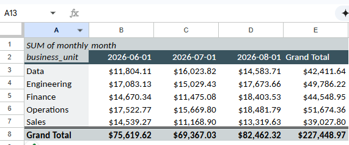

# Public Study Log

This is a curated record of hands-on cloud and FinOps study work. It documents objectives, attempts, feedback, and takeaways without reproducing private conversations, personal details, account information, or interview logistics.

## Session 1: Cloud Billing Dataset Orientation

**Objective:** Classify the fields in a synthetic multi-cloud billing dataset before building calculations.

**Why it matters:** Cloud-cost analysis combines business accountability with technical resource data. Correctly separating ownership, resource, usage, and cost fields makes later reporting, allocation, and investigation work more reliable.

**Tooling:** Google Sheets or another spreadsheet application that can open `.xlsx` files.

**Exercise:** Review the `Raw Billing` worksheet and assign each of its 16 fields to one of four groups:

1. Ownership and business context
2. Technical resource context
3. Usage and utilization
4. Financial and cost measures

**Attempt and feedback:** The first field reviewed was `account`. The initial attempt treated it as a spend value. Review clarified the distinction between an account label, which identifies a responsible billing scope, and `monthly_cost`, which contains the dollar amount. Therefore, `account` belongs to ownership and business context.

**Lab 01, Step 1: Missing ownership review**

**Task:** Filter the `owner` field to show blank values only.

**Method:** Used the column filter, cleared all selected values, selected only `(Blanks)`, and applied the filter.

**Why it matters:** A missing owner prevents clear accountability for cloud spend. This filter is a practical first step for identifying spend that needs ownership assignment before optimization or chargeback decisions.

**Conclusion:** When the owner is blank, the organization cannot clearly identify the person or team accountable for that resource's cost.

**Lab 01, Step 2: Missing cost-center review**

**Task:** Filter the `cost_center` field to show blank values only.

**Method:** Reset the prior filter, then used the `cost_center` column filter to select only `(Blanks)`.

**Result:** The filtered view isolated resources that have a business unit but no cost-center assignment.

**Conclusion:** Without a cost center, the organization cannot reliably allocate the resource's spend to the correct department for reporting or chargeback.

**Lab 01, Step 3: High-cost production review**

**Task:** Find production resources costing more than $500 per month.

**Method:** Filtered `environment` to `prod`, then applied the condition `monthly_cost` greater than `500`.

**Result:** 179 of 540 synthetic billing records met both conditions.

**Takeaway:** High cost is a review signal, not proof of waste. The next step is to investigate utilization, business purpose, and ownership before recommending a change.

**Operational safeguard:** Do not immediately shut down or resize a costly production resource. First confirm what it supports, whether it is appropriately utilized, how critical it is, and who owns the decision.

**Lab 01, Step 4: Total spend by business unit with `SUMIFS`**

**Task:** Calculate total `monthly_cost` for the Operations business unit.

**Formula:** `=SUMIFS('Raw Billing'!M:M,'Raw Billing'!D:D,"Operations")`

**Result:** `$51,674.36`

**How it works:** The formula adds values from column M (`monthly_cost`) only when the matching value in column D (`business_unit`) is `Operations`.

**Lab 01, Step 5: Count long-running non-production resources with `COUNTIFS`**

**Task:** Count resources that are not in production and have more than 650 usage hours.

**Formula:** `=COUNTIFS('Raw Billing'!G:G,"<>prod",'Raw Billing'!L:L,">650")`

**Result:** `52` resources

**How it works:** `COUNTIFS` counts rows where `environment` is not `prod` and `usage_hours` exceeds 650. The `<>` operator means “not equal to.”

**Takeaway:** Long-running non-production resources are candidates for investigation because development or test workloads may be able to follow a schedule. Validate their purpose and ownership before making a change.

**Lab 01, Step 6: Map a cost center with `XLOOKUP`**

**Task:** Return the chargeback owner associated with cost center `CC-300`.

**Formula:** `=XLOOKUP("CC-300",'Cost Centers'!A:A,'Cost Centers'!C:C)`

**Result:** `Marcus Reed`

**How it works:** `XLOOKUP` searches column A (`cost_center`) on the `Cost Centers` sheet for `CC-300`, then returns the corresponding value from column C (`chargeback_owner`).

**Takeaway:** A lookup table translates billing metadata into accountable business information, which supports accurate showback or chargeback reporting.

**Lab 01, Step 7: PivotTable for monthly cost by business unit and month**

**Task:** Create a decision-friendly summary of spend over time by business unit.

**Configuration:**

- **Rows:** `business_unit`
- **Columns:** `month`
- **Values:** `SUM of monthly_cost`

**How it works:** The PivotTable groups the synthetic billing records by business unit and month, then totals monthly cost for every intersection.

**Takeaway:** This report makes it easier to spot spend trends, compare departments, and drill into unusual changes before deciding on an optimization action.

**Evidence:** 

**Lab 01, Step 8: PivotTable drill-down by cloud provider and service**

**Task:** Extend the business-unit cost trend report so a reviewer can isolate provider and service-level drivers.

**Configuration:** Added `cloud_provider` and `service` beneath `business_unit` in the PivotTable Rows area; retained `month` as Columns and `SUM of monthly_cost` as Values.

**How it works:** The row hierarchy supports progressive analysis: business unit → cloud provider → service. A double-click on a PivotTable value can also create a detail sheet containing the source rows behind that total.

**Takeaway:** A cost trend is only the starting point. Drill-down makes it possible to trace a variance to the provider and service producing it before engaging the accountable owner.

**Status:** Step 8 complete. Next, calculate month-over-month total-spend change.
